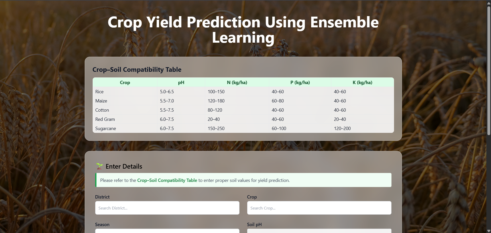
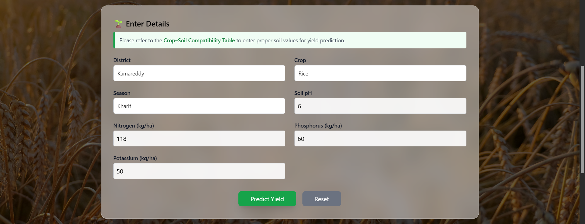
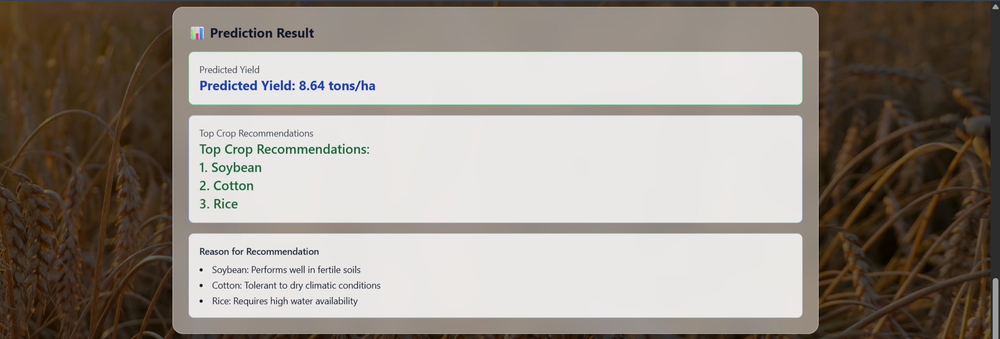

# Crop Yield Prediction Using Ensemble Learning

## Overview

Crop Yield Prediction is a machine learning web application that predicts crop yield and recommends suitable crops using agricultural and environmental data. The system uses ensemble learning techniques to improve prediction accuracy and support data-driven agricultural decisions.

## Features

* Crop yield prediction
* Crop recommendation system
* Interactive web interface
* Ensemble machine learning models
* Agricultural data analysis

## Tech Stack

### Frontend

* HTML
* CSS
* JavaScript

### Backend

* Python
* Flask

### Machine Learning

* Pandas
* Scikit-learn
* Ensemble Learning

## Screenshots

### Home Page

### Prediction Page

### Result Page

## Project Structure

backend/
frontend/
screenshots/
README.md

## Installation

1. Clone the repository

2. Install dependencies

pip install -r backend/requirements.txt

3. Run the application

python backend/app.py

## Future Improvements

* Real-time weather integration
* Mobile-friendly interface
* Advanced analytics dashboard
* Cloud deployment

## Author

Chinna Beera Shivaji Rao
